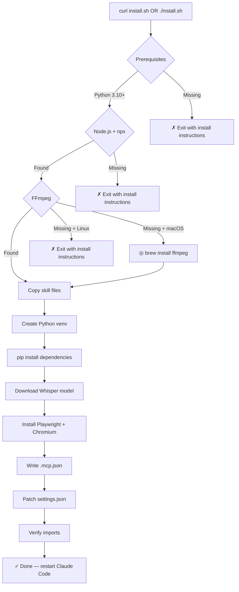
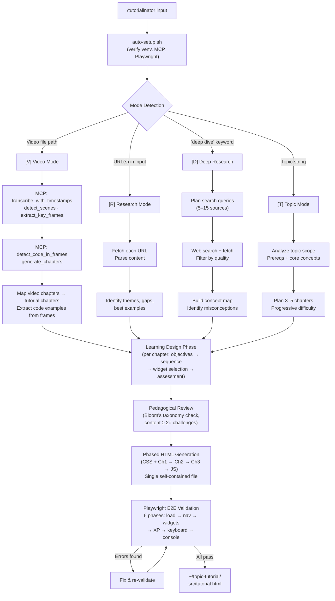
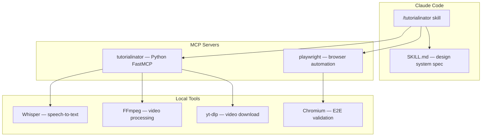

# Tutorialinator

```
     ╔═══════════════════════════════════════════════════════════════╗
     ║                                                               ║
     ║    ████████╗██╗   ██╗████████╗ ██████╗ ██████╗ ██╗ █████╗     ║
     ║    ╚══██╔══╝██║   ██║╚══██╔══╝██╔═══██╗██╔══██╗██║██╔══██╗    ║
     ║       ██║   ██║   ██║   ██║   ██║   ██║██████╔╝██║███████║    ║
     ║       ██║   ██║   ██║   ██║   ██║   ██║██╔══██╗██║██╔══██║    ║
     ║       ██║   ╚██████╔╝   ██║   ╚██████╔╝██║  ██║██║██║  ██║    ║
     ║       ╚═╝    ╚═════╝    ╚═╝    ╚═════╝ ╚═╝  ╚═╝╚═╝╚═╝  ╚═╝    ║
     ║                                                               ║
     ║       ██╗     ██╗███╗   ██╗ █████╗ ████████╗ ██████╗ ██████╗  ║
     ║       ██║     ██║████╗  ██║██╔══██╗╚══██╔══╝██╔═══██╗██╔══██╗ ║
     ║       ██║     ██║██╔██╗ ██║███████║   ██║   ██║   ██║██████╔╝ ║
     ║       ██║     ██║██║╚██╗██║██╔══██║   ██║   ██║   ██║██╔══██╗ ║
     ║       ███████╗██║██║ ╚████║██║  ██║   ██║   ╚██████╔╝██║  ██║ ║
     ║       ╚══════╝╚═╝╚═╝  ╚═══╝╚═╝  ╚═╝   ╚═╝    ╚═════╝ ╚═╝  ╚═╝ ║
     ║                                                               ║
     ╚═══════════════════════════════════════════════════════════════╝

        [▓▓▓▓▓]═══════════════════════════════════════[▓▓▓▓▓]

       ┌─────────┐   ┌─────────┐   ┌─────────┐   ┌──────────┐
       │  VIDEO  │   │  TOPIC  │   │   WEB   │   │   DEEP   │
       │   .mp4  │   │ "teach" │   │  URLs   │   │ RESEARCH │
       └────┬────┘   └────┬────┘   └────┬────┘   └────┬─────┘
            │             │             │             │
            └─────────────┴──────┬──────┴─────────────┘
                                 │
                            ╔════╧════╗
                            ║   AI    ║
                            ║  ⚡⚡⚡⚡   ║
                            ╚════╤════╝
                                 │
                          ┌──────┴──────┐
                          │  TUTORIAL   │
                          │    SITE     │
                          └─────────────┘
```

Transform videos, topics, or web resources into immersive, interactive single-HTML tutorials — powered by Claude Code.

```bash
curl -fsSL https://raw.githubusercontent.com/masudl-hub/tutorialinator/main/install.sh | bash
```

Each tutorial is a **single self-contained HTML file**: one `<style>` block, one `<script>` block, zero external dependencies. Open it in a browser. That's it.

---

```
  ════════════════════════════════════════════════════════
  ▓▓▓  S E C U R I T Y   &   T R U S T
  ════════════════════════════════════════════════════════
```

**Read this first.** You're about to run an installer. Here's exactly what it does and doesn't do.

```
  ╭───────────────── What the installer does ─────────────────╮
  │                                                            │
  │  ✓  Creates ~/.claude/skills/tutorialinator/               │
  │     Skill files: SKILL.md, templates, MCP server code      │
  │                                                            │
  │  ✓  Creates a Python venv                                  │
  │     At ~/.claude/skills/tutorialinator/mcp-server/venv/    │
  │                                                            │
  │  ✓  Runs pip install                                       │
  │     Packages from PyPI into the venv (see Dependencies)    │
  │                                                            │
  │  ✓  Downloads a Whisper model                              │
  │     ~140 MB (base) or ~1.5 GB (large) to ~/.cache/whisper/ │
  │                                                            │
  │  ✓  Installs Playwright + Chromium                         │
  │     For E2E validation of generated tutorials              │
  │                                                            │
  │  ✓  Writes .mcp.json                                       │
  │     MCP server configuration inside the skill directory    │
  │                                                            │
  │  ✓  Patches ~/.claude/settings.json                        │
  │     Adds "enableAllProjectMcpServers": true                │
  │                                                            │
  ╰────────────────────────────────────────────────────────────╯
```

```
  ╭──────────────── What it does NOT do ──────────────────╮
  │                                                        │
  │  ✗  No sudo — never asks for elevated privileges       │
  │  ✗  No system-wide changes — only ~/.claude/ & ~/.cache│
  │  ✗  No telemetry — zero data collection, no phone-home │
  │  ✗  No API keys — Whisper runs locally, no external AI │
  │  ✗  No runtime network — everything local once installed│
  │     (except yt-dlp when you choose to fetch a video)   │
  │                                                        │
  ╰────────────────────────────────────────────────────────╯
```

### How to review

- [View install.sh source](install.sh) — the complete installer, ~630 lines of bash
- [View uninstall.sh source](uninstall.sh) — clean removal, ~190 lines
- All code runs on your machine. Whisper is local neural network inference. No data leaves your computer.

### Dependencies

All installed into an isolated Python virtual environment (not system-wide):

```
  ╭──────────────── Installed Packages ───────────────────╮
  │                                                        │
  │  • openai-whisper   Local speech-to-text               │
  │  • mcp             Model Context Protocol SDK          │
  │  • fastmcp         FastMCP server framework            │
  │  • yt-dlp          Video downloading                   │
  │  • ffmpeg-python   FFmpeg bindings                     │
  │  • pydantic        Data validation                     │
  │  • httpx           HTTP client                         │
  │  • beautifulsoup4  HTML parsing                        │
  │  • rich            Terminal formatting                  │
  │                                                        │
  ╰────────────────────────────────────────────────────────╯
```

Links: [openai-whisper](https://github.com/openai/whisper) · [mcp](https://github.com/modelcontextprotocol/python-sdk) · [fastmcp](https://github.com/jlowin/fastmcp) · [yt-dlp](https://github.com/yt-dlp/yt-dlp) · [ffmpeg-python](https://github.com/kkroening/ffmpeg-python) · [pydantic](https://github.com/pydantic/pydantic) · [httpx](https://github.com/encode/httpx) · [beautifulsoup4](https://www.crummy.com/software/BeautifulSoup/) · [rich](https://github.com/Textualize/rich)

Optional enhanced: `whisper-timestamped`, `rapidocr-onnxruntime`, `opencv-python`

```
  ╭──────────────── System Prerequisites ─────────────────╮
  │                                                        │
  │  Component        Status    Purpose                    │
  │  ─────────────────────────────────────────────         │
  │  Python 3.10+     required  Runtime environment        │
  │  Node.js + npx    required  Playwright & tooling       │
  │  FFmpeg           required  Video processing           │
  │                   (auto-installed via Homebrew on mac)  │
  │                                                        │
  ╰────────────────────────────────────────────────────────╯
```

---

```
  ════════════════════════════════════════════════════════
  ▓▓▓  W H A T   G E T S   I N S T A L L E D
  ════════════════════════════════════════════════════════
```

```
  ~/.claude/
  ├── skills/tutorialinator/           ← Skill files
  │   ├── SKILL.md                     ← Main specification (~1275 lines)
  │   ├── auto-setup.sh                ← Health check script
  │   ├── .mcp.json                    ← MCP server configuration
  │   ├── templates/
  │   │   ├── README.md
  │   │   └── DESIGN_UPDATES.md
  │   └── mcp-server/
  │       ├── pyproject.toml
  │       ├── venv/                    ← Python virtual environment
  │       └── mcp_video_tutorial/
  │           ├── __init__.py
  │           ├── __main__.py
  │           └── server.py            ← MCP server (7 video tools)
  │
  └── settings.json                    ← enableAllProjectMcpServers: true

  ~/.cache/
  └── whisper/                         ← Whisper model (~140 MB or ~1.5 GB)
```

---

```
  ════════════════════════════════════════════════════════
  ▓▓▓  H O W   I T   W O R K S
  ════════════════════════════════════════════════════════
```

### Installation Flow



### Tutorial Generation



> **Note — Agent Teams (recommended):** For complex tutorials, the skill can spawn agent teams — parallel researchers, content writers, and reviewers that collaborate before final HTML generation. Teams provide deeper research (dedicated agents explore more sources), better quality (separate review agent catches learning design gaps), and smarter context management (heavy research doesn't eat into the HTML generation budget). This requires **Claude Code agent teams** to be enabled. The skill works without them, but produces deeper tutorials with teams on.

### Architecture



---

```
  ════════════════════════════════════════════════════════
  ▓▓▓  U S A G E
  ════════════════════════════════════════════════════════
```

```
  ╭──────────────── Supported Input Modes ─────────────────╮
  │                                                        │
  │  Mode             Description                          │
  │  ─────────────────────────────────────────────         │
  │  [V] Video        Video files or YouTube/Vimeo URLs    │
  │  [T] Topic        Topic descriptions via Claude        │
  │  [R] Research     Web URLs and documentation           │
  │  [D] Deep         Comprehensive multi-source research  │
  │                                                        │
  ╰────────────────────────────────────────────────────────╯
```

### Video Mode
Turn a video into an interactive tutorial:
```bash
/tutorialinator ~/Downloads/react-hooks-talk.mp4
/tutorialinator "https://www.youtube.com/watch?v=dQw4w9WgXcQ"
```

### Topic Mode
Generate a tutorial from Claude's knowledge:
```bash
/tutorialinator "teach me TypeScript generics"
/tutorialinator "create a tutorial on CSS Grid for beginners"
```

### Research Mode
Synthesize multiple web resources into a tutorial:
```bash
/tutorialinator "build a tutorial from these resources: https://react.dev/learn https://overreacted.io/useeffect/"
```

### Deep Research Mode
Comprehensive web research into a tutorial:
```bash
/tutorialinator "research Rust ownership thoroughly and teach me"
/tutorialinator "deep dive into WebAssembly and create a tutorial"
```

### Output

Every mode produces a single HTML file:

```
  ~/[topic]-tutorial/src/tutorial.html
```

Open it in any browser. No server needed.

---

```
  ════════════════════════════════════════════════════════
  ▓▓▓  W H I S P E R   M O D E L S
  ════════════════════════════════════════════════════════
```

The installer lets you choose between two Whisper models for video transcription:

```
  ╭──────────────── Whisper Model Selection ───────────────╮
  │                                                        │
  │  Model    Size       Speed     Accuracy    Best for    │
  │  ──────────────────────────────────────────────────    │
  │  base     ~140 MB    Fast      Good        Clear audio │
  │           ██░░░░░░░░                       English     │
  │                                            Screencasts │
  │                                                        │
  │  large    ~1.5 GB    Slower    Excellent   Noisy audio │
  │           ██████████                       Accents     │
  │                                            Non-English │
  │                                                        │
  ╰────────────────────────────────────────────────────────╯
```

The model is only used in **Video Mode**. Topic, Research, and Deep Research modes don't need Whisper at all.

To switch models later, re-run the installer or manually download:
```bash
~/.claude/skills/tutorialinator/mcp-server/venv/bin/python -c "import whisper; whisper.load_model('large')"
```

---

```
  ════════════════════════════════════════════════════════
  ▓▓▓  P R E R E Q U I S I T E S   B Y   O S
  ════════════════════════════════════════════════════════
```

### macOS

```bash
# Homebrew (if not installed)
/bin/bash -c "$(curl -fsSL https://raw.githubusercontent.com/Homebrew/install/HEAD/install.sh)"

# Required
brew install python@3.12 node ffmpeg
```

### Ubuntu / Debian

```bash
sudo apt update
sudo apt install python3.12 python3.12-venv nodejs npm ffmpeg
```

### Fedora

```bash
sudo dnf install python3.12 nodejs npm ffmpeg
```

---

```
  ════════════════════════════════════════════════════════
  ▓▓▓  T R O U B L E S H O O T I N G
  ════════════════════════════════════════════════════════
```

### MCP server not loading
Restart Claude Code after installation. The MCP servers load on startup.

### "enableAllProjectMcpServers" warning
Check that `~/.claude/settings.json` contains:
```json
{
  "enableAllProjectMcpServers": true
}
```

### Broken Python venv
The installer self-heals broken venvs. Re-run `install.sh` or:
```bash
rm -rf ~/.claude/skills/tutorialinator/mcp-server/venv
# Then re-run install.sh
```

### Whisper model download fails
Models are cached at `~/.cache/whisper/`. If download fails, it retries automatically on first use. Manual download:
```bash
~/.claude/skills/tutorialinator/mcp-server/venv/bin/python -c "import whisper; whisper.load_model('base')"
```

### FFmpeg not found
The installer auto-installs FFmpeg via Homebrew on macOS. On Linux:
```bash
sudo apt install ffmpeg        # Ubuntu/Debian
sudo dnf install ffmpeg        # Fedora
```

### Playwright / Chromium issues
Playwright is for E2E validation. If it fails, tutorials still generate — you just skip automated browser testing:
```bash
npx --yes @playwright/mcp@latest --version
npx playwright install chromium
```

### Import errors after install
Run verification manually:
```bash
~/.claude/skills/tutorialinator/mcp-server/venv/bin/python -c "import mcp; import whisper; import fastmcp; print('All good')"
```

---

```
  ════════════════════════════════════════════════════════
  ▓▓▓  U N I N S T A L L
  ════════════════════════════════════════════════════════
```

```bash
# From the repo
./uninstall.sh

# Or directly
bash <(curl -fsSL https://raw.githubusercontent.com/masudl-hub/tutorialinator/main/uninstall.sh)
```

```
  ╭──────────────── What gets removed ─────────────────────╮
  │                                                        │
  │  ✓  ~/.claude/skills/tutorialinator/    Always         │
  │  ?  ~/.cache/whisper/                   Asks first     │
  │  ?  ~/.cache/video-tutorial/            Asks first     │
  │  ✓  enableAllProjectMcpServers          From settings  │
  │                                                        │
  │  ✗  Does NOT remove Python, Node.js, or FFmpeg         │
  │                                                        │
  ╰────────────────────────────────────────────────────────╯
```

---

## License

[MIT](LICENSE)
